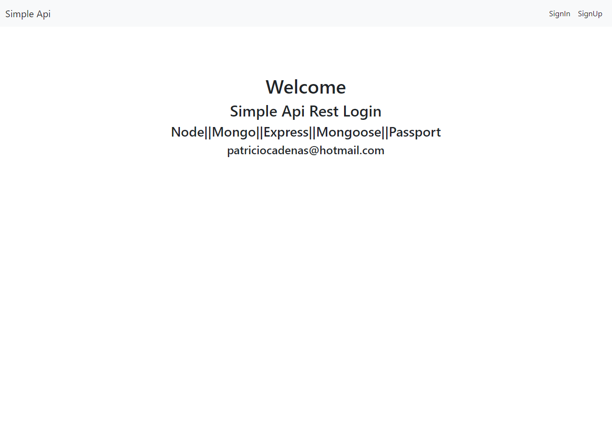

#Basic Api

Make with
 >- node
 >- Express 
 >- MongoDB Local Connection
 >- Mongoose
 >- Passport (Auth)
 >- Views ejs(Login Form Boostrap)

` Using for run`

    npm install
    create file .env
    Write the environments into .env file  variables.
    PORT=XXXX
    DBCONNECT=XXXXXXXXXXX
    npm run dev    

Landing Page

